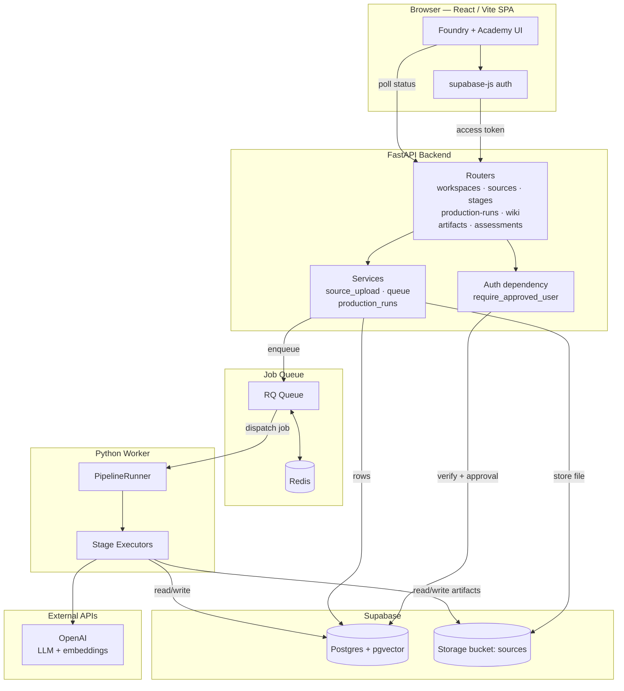
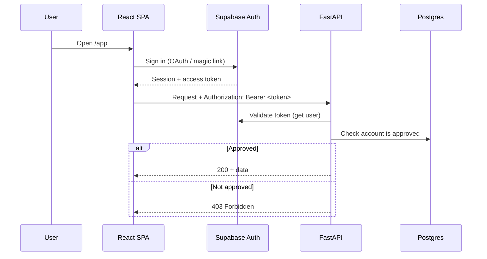
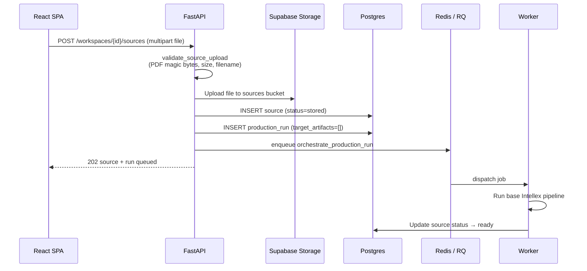
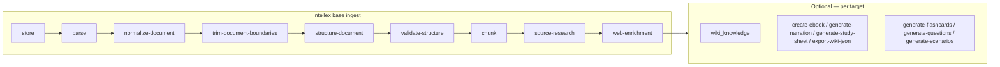
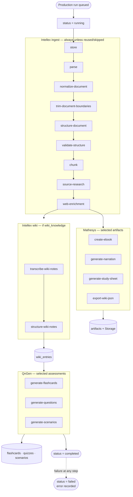
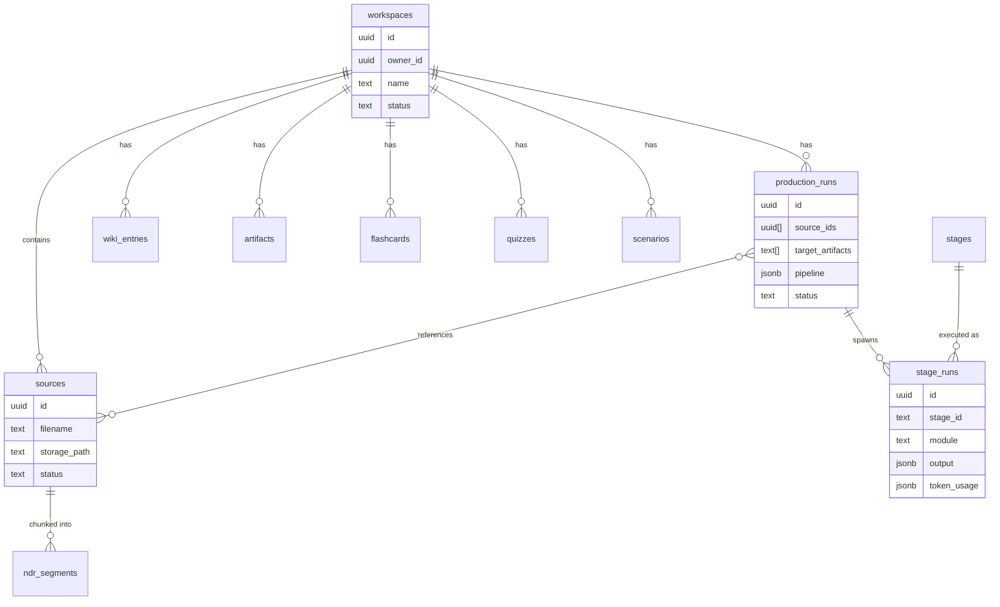

# Arsenal

Arsenal is a private educational system with two surfaces in one SPA:

- **Foundry** — browser-based **educational production studio**. Upload sources, run Intellex ingest and Wiki Knowledge, and generate Mathesys artifacts plus QnGen assessments over a queued worker pipeline.
- **Academy** — learning surface. **Library** is the catalog of artifacts, wiki entries, and assessments. Foundry produces; Academy curates.

| Foundry system | Role | Module |
|--------|------|--------|
| **Intellex** | Ingest and grounded knowledge: structured source (chapters/chunks/research) plus Wiki Knowledge → canonical `wiki_entries`. Not “Library.” | `intellex` |
| **Mathesys** | File artifacts from the structured source (ebook, narration, wiki JSON snapshot, study sheet). | `mathesys` |
| **QnGen** | Flashcards, quizzes, and scenarios from canonical wiki + evidence. | `qngen` |

Names, output kinds, and module ownership: [`docs/internal/system/system-overview.md`](docs/internal/system/system-overview.md). Mathesys file contracts: [`docs/internal/system/artifacts-catalog.md`](docs/internal/system/artifacts-catalog.md).

---

## High-Level Architecture



The browser authenticates with Supabase directly (`supabase-js`) and sends the resulting access token to FastAPI on every request. FastAPI verifies the token and an approval check before serving data. Long-running AI work never blocks the request: the API enqueues a job on Redis/RQ, and a separate Python worker executes the pipeline, writing results back to Postgres and Storage that the UI polls.

---

## Request & Authentication Flow



Every endpoint except `/health` requires `Authorization: Bearer <supabase-access-token>`. The `require_approved_user` dependency rejects invalid sessions (401) and unapproved accounts (403). The backend uses the Supabase **service role** key for data access; the service role key is never exposed to the frontend.

---

## Source Upload & Ingest

Uploading a source automatically queues an **ingest-only** production run (the Intellex base pipeline). PDFs are the only supported source type today.



---

## The Production Pipeline

A **production run** is one work order: selected sources plus `target_artifacts` (Intellex wiki, Mathesys files, QnGen assessments). Empty targets = ingest only. The backend builds an ordered pipeline (`build_pipeline`) and enqueues it. `PipelineRunner` executes each step and updates the run’s `pipeline` JSON so OPS can show progress.

### Pipeline composition

Intellex **base ingest** always runs (or is skipped when that source is already ingested). Optional steps are appended from `target_artifacts`. `wiki_knowledge` is Intellex, not Mathesys.



| `target_artifact` | Pipeline step | Module | Output kind |
|-------------------|---------------|--------|-------------|
| `wiki_knowledge` | `transcribe-wiki-notes` + `structure-wiki-notes` | Intellex | Wiki entries |
| `electronic_book` | `create-ebook` | Mathesys | Artifact (EPUB) |
| `narration_audio` | `generate-narration` | Mathesys | Artifact |
| `study_sheet` | `generate-study-sheet` | Mathesys | Artifact (PDF) |
| `wiki_json` | `export-wiki-json` | Mathesys | Artifact (snapshot of wiki) |
| `flashcards` | `generate-flashcards` | QnGen | Assessments |
| `quizzes` | `generate-questions` | QnGen | Assessments |
| `scenarios` | `generate-scenarios` | QnGen | Assessments |

Canonical step lists: [`api/app/pipeline.py`](api/app/pipeline.py) and [`api/README.md`](api/README.md).

### Full pipeline execution



Each stage step runs once per selected source and writes an immutable `stage_run`. Ingest builds the structured source (`document_chapters`, `ndr_segments`). Wiki Knowledge writes canonical `wiki_entries` from the source file as notes. Mathesys packages files; QnGen reads the wiki. A failed step marks the run `failed` and resets in-flight sources.

---

## Data Model



Stages are **versioned definitions** (`stage_id` + `version`, major.minor format such as `1.0` or `2.0`) seeded in Postgres; each execution creates a `stage_run` capturing the exact inputs, output, model, and token usage. Postgres has `pgvector` enabled for embedding-based search over NDR segments and wiki entries.

---

## Tech Stack

| Layer | Technology |
|-------|------------|
| Frontend | React + Vite + TypeScript, React Router |
| Auth | Supabase Auth (`supabase-js`) |
| Backend API | FastAPI (Python) |
| Job queue | RQ + Redis |
| Workers | Python (`PipelineRunner` + stage executors) |
| Database | Supabase Postgres + pgvector |
| File storage | Supabase Storage (`sources` bucket; per-source `parse/`, `structure/`, `narration/`, `artifacts/`) |
| LLM / embeddings | OpenAI |
| PDF parsing | LlamaParse (LlamaCloud, agentic tier) |

---

## Repository Layout

```text
Arsenal/
├── api/                      FastAPI backend + worker
│   └── app/
│       ├── routers/          HTTP endpoints
│       ├── services/         upload, queue, supabase, openai
│       ├── repositories/     Postgres data access
│       ├── intellex/         ingest, structure, research, wiki-knowledge stages
│       ├── mathesys/         ebook, narration, study sheet, wiki JSON export
│       ├── qngen/            flashcard / quiz / scenario stages
│       ├── worker/           PipelineRunner, stage executors, RQ jobs
│       └── pipeline.py       pipeline composition (base + optional steps)
├── app/                      React + Vite frontend
│   └── src/
│       ├── features/         auth + workspace providers
│       ├── components/foundry/   Foundry production UI
│       ├── components/academy/   Academy learning UI
│       └── lib/              API client + mappers
├── supabase/
│   └── setup/                greenfield SQL (01–04) + alter patches for existing DBs
├── docker/                   docker-compose (Redis)
└── docs/internal/            system overview & design notes
```

---

## Getting Started

Setup, environment variables, and the full endpoint reference live in [`api/README.md`](api/README.md). In short:

1. **Backend** — create a venv, install `api/requirements.txt`, populate `api/.env`, run `uvicorn app.main:app --reload --port 8000`.
2. **Queue + Worker** — start Redis (`docker compose up -d redis`), then run `python run_worker.py`.
3. **Database** — for a new Supabase project, run `01`–`04` in order (see [`supabase/setup/README.md`](supabase/setup/README.md)). Existing databases use the `alter-*.sql` patches in that same folder — see [`supabase/README.md`](supabase/README.md).
4. **Frontend** — point `VITE_API_BASE_URL` at the API and run the Vite dev server (see [`app/README.md`](app/README.md)).

Canonical organization (names, systems, output kinds): [`docs/internal/system/system-overview.md`](docs/internal/system/system-overview.md).
